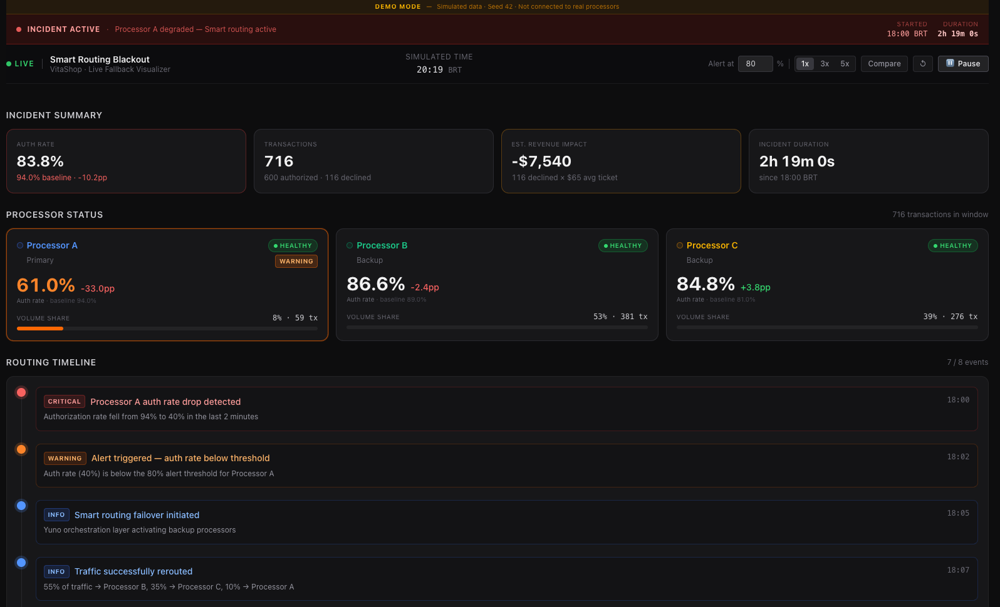
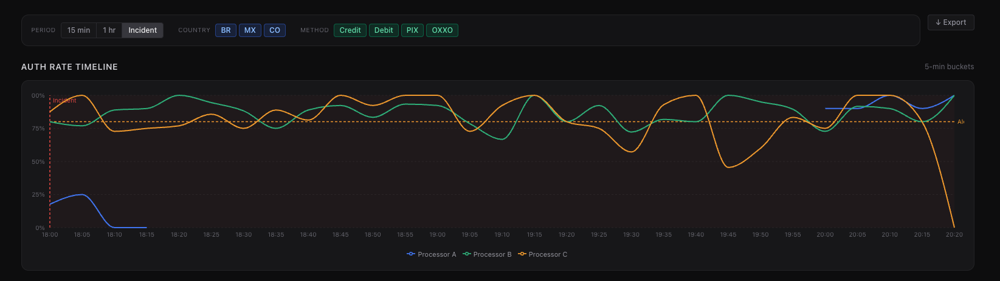
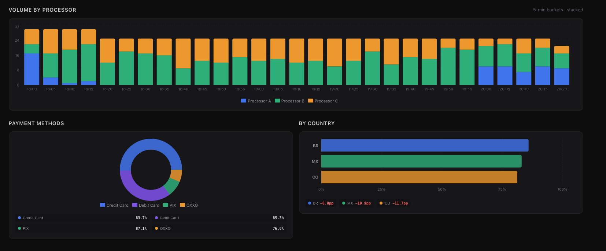

# Smart Routing Blackout — Live Fallback Visualizer

> **War room dashboard for Yuno payment orchestration.**
> Real-time visibility into processor health, smart routing decisions, and incident impact — built for VitaShop's ops team during a 3 AM outage.

---

## Screenshots

### Incident Overview — KPIs, Processor Status & Routing Timeline


*DEMO MODE banner · Incident Active strip · 4 KPI cards (auth rate, volume, revenue impact, duration) · Processor A in WARNING with -33pp delta · Routing timeline with 7/8 events revealed progressively*

---

### Auth Rate Timeline — 3 Processors Over Time


*Line chart with 5-min buckets · Processor A (blue) collapses at 18:00 then recovers at 20:05 · B (green) and C (orange) stabilize above the 80% alert threshold (dashed line) · Incident marker at 18:00*

---

### Volume Distribution, Payment Methods & Country Breakdown


*Stacked bars show the traffic shift from A → B+C after failover · Donut chart shows auth rates per payment method (PIX leads at 87.1%) · Country heatmap shows all three markets impacted (-8 to -11.7pp vs baseline)*

---

## Setup

```bash
npm install
npm run dev
```

Open [http://localhost:5173](http://localhost:5173) — the simulation starts automatically at **18:30 BRT**, 30 minutes into the incident, so all charts are populated immediately.

---

## Features

### Core Requirements ✅
- **Real-time routing visualization** — Processor health badges (healthy/degraded/down), live auth rates with baseline delta, volume share bars, and a progressive routing event timeline
- **Multi-dimensional breakdown** — Filter by time period (15 min / 1 hr / since incident), country (BR / MX / CO), and payment method (Credit / Debit / PIX / OXXO). All charts update simultaneously
- **Incident summary** — 4 KPI cards: auth rate vs 94% baseline, transaction volume, estimated revenue impact, live duration counter

### Stretch Goals ✅
- **A — Alert thresholds** — Processor cards turn orange (WARNING) or red (CRITICAL + pulse) when auth rate drops below the configurable threshold (default 80%). Reference line on the auth rate chart
- **B — Processor comparison mode** — Toggle "Compare" in the header → 3-column side-by-side `ComposedChart` (auth rate line + volume bars) per processor
- **C — Export incident report** — "↓ Export" button downloads a timestamped JSON with incident summary, routing events, processor performance metrics, active filters, and the LCG seed for data reproduction
- **D — Real-time simulation** — Auto-advancing clock (3s = 1 simulated minute). Pause/Resume toggle + 1x / 3x / 5x speed control in the header. Loops back to incident start on completion

---

## Tech Stack

| Tool | Version | Purpose |
|------|---------|---------|
| React | 18.3 | UI framework |
| TypeScript | 5.7 | Type safety |
| Vite | 6 | Build tool + HMR |
| Tailwind CSS | v4 | Styling (via `@tailwindcss/vite`) |
| Recharts | 2.13 | Data visualizations |
| Zustand | 5 | Global state + simulation clock |
| date-fns | 4 | Date formatting |
| Vitest | 3 | Unit tests (113 passing) |

---

## How the Simulation Works

The dashboard replays a 3-hour payment incident in real-time:

```
setInterval (3000ms) → advance currentSimulatedTime by 1 simulated minute
```

- **Full loop**: 180 ticks × 3s = **~9 real minutes** per replay
- **Speed control**: 1x / 3x / 5x — multiplies minutes-per-tick, never recreates the interval
- **All charts**: re-derive from `transactions.filter(t => t.timestamp ≤ currentSimulatedTime)` via `useMemo`
- **Loops back** to 17:00 BRT when simulation reaches 21:00 BRT

### Incident Phases

| Time (BRT) | Processor A | Processor B | Processor C |
|-----------|-------------|-------------|-------------|
| 17:00–18:00 | 100% traffic · 94% auth | — | — |
| 18:00–18:05 | Degrading → 15% · 28% auth | Ramping | Ramping |
| 18:05–18:20 | 10% · **8% auth** | 55% · 87% | 35% · 79% |
| 18:20–20:00 | **DOWN** | 58% · 89% | 42% · 81% |
| 20:00–21:00 | Recovering → 60% · 93% | Scaling down | Scaling down |

---

## Data Reproducibility

All data is generated client-side using a **deterministic LCG PRNG seeded with 42**.
Every refresh, every evaluator, every environment produces identical data.

```typescript
import { generateIncidentData } from './src/data/generator';
const { transactions, incident } = generateIncidentData(42);
// → 1,200+ transactions across 5 incident phases
```

**LCG parameters** (Numerical Recipes): `a=1664525 · c=1013904223 · m=2³²`

The seed is embedded in every exported JSON report.

---

## Project Structure

```
src/
├── types/index.ts              # All TypeScript interfaces + union types
├── constants/processors.ts     # Shared color tokens (hex + Tailwind statics)
├── data/generator.ts           # Seeded LCG mock data generator
├── store/dashboard.store.ts    # Zustand: clock + filters (transactions outside store)
├── hooks/
│   ├── useSimulation.ts        # setInterval tick with useRef StrictMode guard
│   ├── useFilteredData.ts      # Binary search O(log n) filter
│   ├── useTimeBuckets.ts       # 5-min bucket aggregation
│   └── useIncidentMetrics.ts   # KPI derivation with NaN guards
├── lib/utils.ts                # formatCurrency, formatPercent, cn(), binarySearch
├── components/
│   ├── layout/                 # DashboardHeader, DashboardLayout
│   ├── incident/               # IncidentBanner (DEMO MODE), IncidentSummaryCard
│   ├── filters/                # DashboardFilters
│   ├── processors/             # ProcessorCard, ProcessorStatusGrid, ProcessorCompare
│   ├── charts/                 # AuthRateTimeline, VolumeStackedBar, RoutingTimeline,
│   │                           # PaymentMethodBreakdown, CountryHeatmap
│   └── export/                 # ExportButton (Stretch C)
└── pages/IncidentDashboard.tsx # Full page assembly
```

---

## Scripts

```bash
npm run dev           # Dev server → localhost:5173
npm run build         # Production build (dist/)
npm run preview       # Preview production build
npm run test          # Run 113 Vitest tests
npm run test:coverage # Coverage report
npm run lint          # ESLint
```

---

## Deploy to Vercel

Pre-configured via `vercel.json` (SPA rewrites, Vite framework).

```bash
npm i -g vercel && vercel --prod
```

Or connect the GitHub repo at [vercel.com/new](https://vercel.com/new) — zero config needed.
No environment variables required (all data is client-side generated).

---

## Design Decisions

See [DESIGN_DECISIONS.md](./DESIGN_DECISIONS.md) for the full write-up (Deliverable 3).

**Key decisions:**
- Line charts for auth rates — trends + processor crossovers are the incident story
- Stacked bars for volume — the A→B+C shift is instantly readable
- Routing timeline above the fold — first question ops asks: "did routing fire?"
- `allTransactions` outside Zustand — prevents 1000+ item serialization per tick
- Speed via amount-per-tick — no interval recreation on speed change, zero jitter

---

## Challenge

See [CHALLENGE.md](./CHALLENGE.md) for the full problem statement and evaluation criteria.

---

*Built for the Yuno Smart Routing Blackout challenge · Seed 42 · 113 tests passing*
